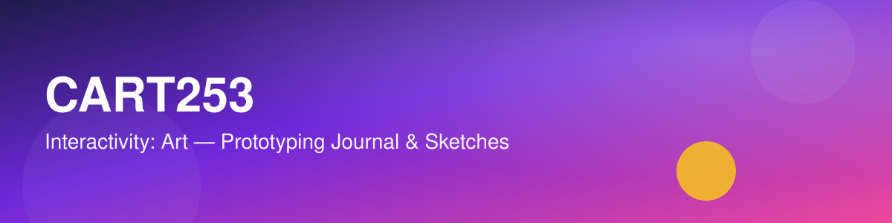

# CART253 🎨

## About This Website

This site collects together and shows off my prototyping work for **CART253: Interactivity Art**. As the semester goes on, I'll be adding sketches, experiments, and assignments here, along with a running [reflective journal](journal.md) of what I'm learning about creative coding, interactivity, and working with Git/GitHub and Markdown.

## Useful Links

- 📓 [My Reflective Journal](journal.md)
- 💻 [My GitHub profile](https://github.com/your-username)
- 🌐 [Course materials](https://pippinbarr.com/cart253/)
- 📖 [The Markdown Guide](https://www.markdownguide.org/)

## Prototypes

This section will grow to contain links to all of my prototypes as I complete them throughout the course.

<!-- Add a new entry for each prototype, e.g.: -->
<!-- - [Prototype 1: Name](./prototype-1/) — a one-line description of what it does -->

- *(Prototypes will be listed here as they're completed.)*

---

*Last updated: September 2026*
