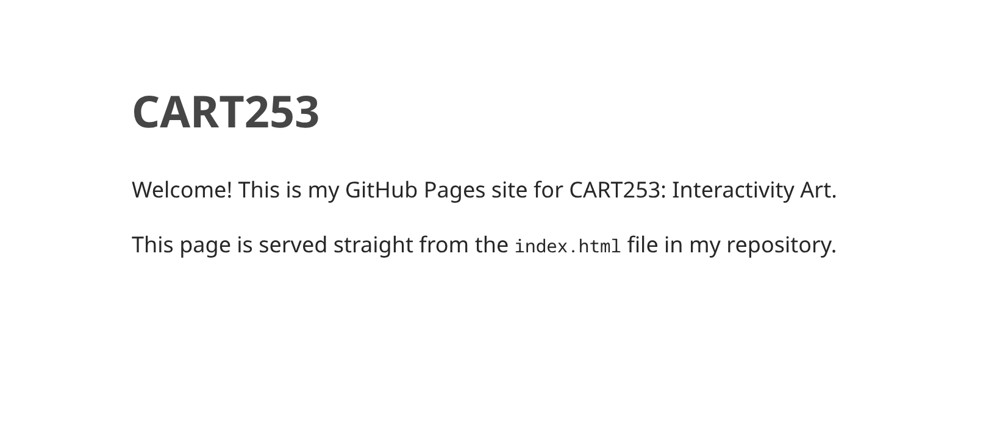

# Reflective Journal

## September 16, 2026

This week I built the first version of my CART253 course website using Markdown and GitHub. I'd used Markdown a lot before. It's a very common format in AI workflows, and the backbone of most github projects.

What surprised me most was how difficult it is to write JS/HTML/CSS, now that I have been using other tools for such a long time.I also did not know that github had natural webhost options, I usually use cloudflare.

I'm not under any impression that this project will last longer than needed. So far, I have no incentives to put in more effort than needed, but I do want to keep things presentable. 

### Screenshot

